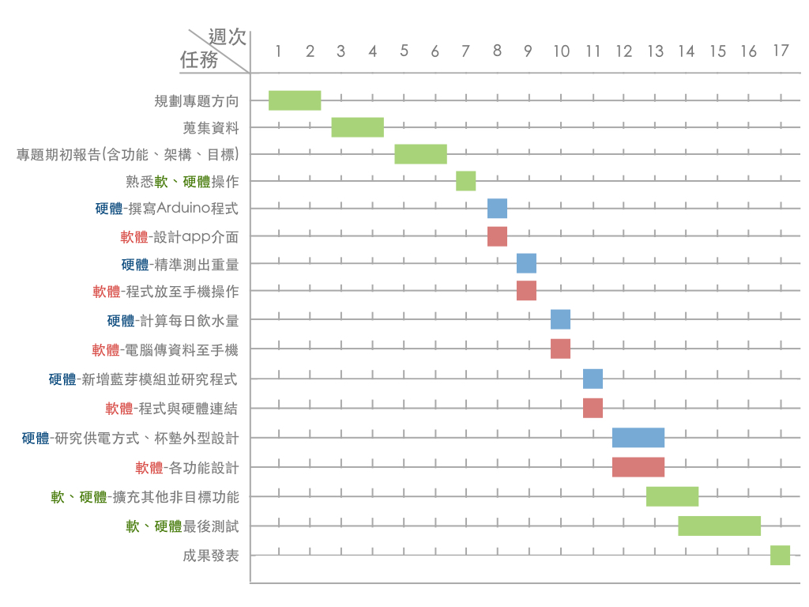

# NKFUST_10
## 專題題目：智慧杯墊 指導老師：張弘毅
### 組員名單：
#### 0424013 廖育滺 0424020 陳怡婷 0424023 林欣平 0424095 楊東瑾
##### 專題內容：利用感測器連結藍芽至手機APP，用剩餘水量差來得知使用者攝取的水量，另外使用者可以設定提醒喝水的時間、也能夠利用統計圖表記錄攝取的水量進而掌握飲水習慣、促進健康。
##### 研究動機：在書桌前讀到忘我的時候，總是會忘記喝水，因此我們設計出一款智慧杯墊，能定時提醒使用者喝水，並結合APP提供一項能查詢一日飲水量之功能。

##### 介面：
